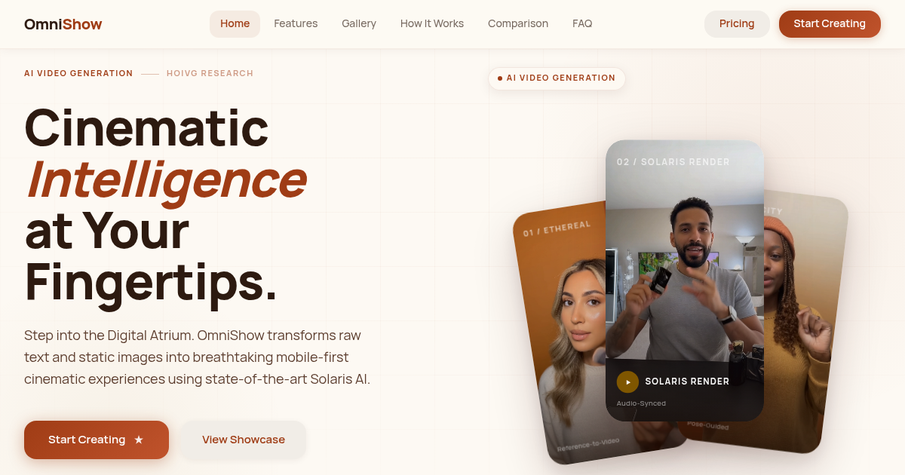

# OmniShow

**OmniShow** is an AI-powered video presentation tool that helps you create stunning visual content with ease. Transform your ideas into professional video presentations in minutes.

## Try OmniShow Now

**[Visit OmniShow](https://omnishow.video)** - Create your first AI-powered video presentation today!

## Features

- **AI-Powered Creation** - Generate professional presentations using advanced AI technology
- **Stunning Visual Templates** - Access hundreds of beautifully designed templates
- **Easy Customization** - Customize colors, fonts, and layouts with simple drag-and-drop
- **Multi-format Export** - Export your videos in various formats for any platform
- **Real-time Collaboration** - Work with your team in real-time on the same project
- **Cloud Storage** - Save and access your projects from anywhere

## Use Cases

- Business Presentations
- Marketing Videos
- Educational Content
- Social Media Posts
- Product Demos
- Training Materials

## Links

- **Official Website**: [OmniShow](https://omnishow.video)
- **Get Started**: [https://omnishow.video](https://omnishow.video)

## License

MIT License - See [LICENSE](LICENSE) for details.

---

2026 [OmniShow](https://omnishow.video). All rights reserved.
